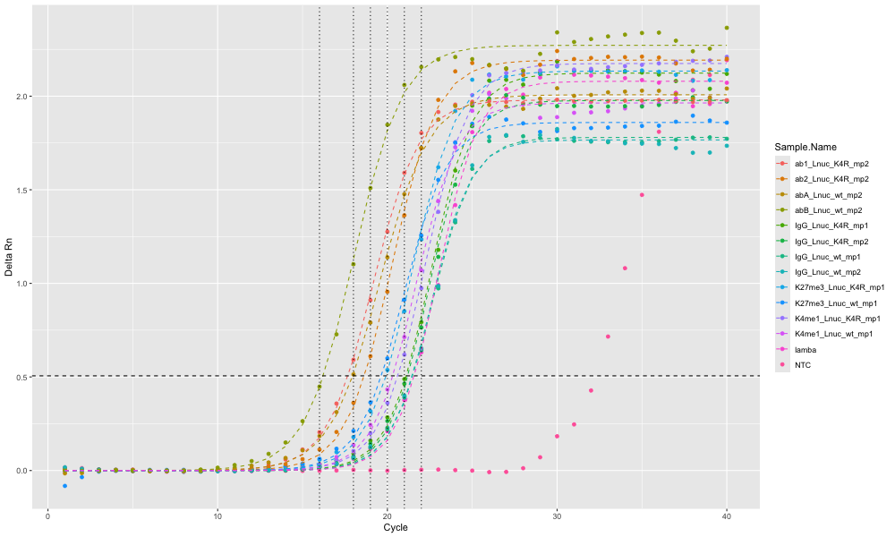

# Calculate Cycle Number for NGS based on qPCR data

Given a qPCR amplification excel file, this script will spit out:

- A plot with the amplification data
- A table with the appropriate cycle number to use for NGS library prep

Each sample's amplification curve is fit to a sigmoid using non-linear least squares regression.From this fit function, we calculate the Delta Rn of the last 10 cycles. We divide this by 4 to get the "threshold" value which a sample must cross. The optimal cycle number is the cycle at which the fit function crosses this threshold, rounded to the nearest integer.

The vertical lines on the plot indicate these cycles.



Example table:

```
   Sample.Name         cycle_thresh
   <chr>                      <dbl>
 1 abB_Lnuc_wt_mp2               16
 2 ab1_Lnuc_K4R_mp2              18
 3 abA_Lnuc_wt_mp2               18
 4 ab2_Lnuc_K4R_mp2              19
 5 K27me3_Lnuc_K4R_mp1           20
 6 K27me3_Lnuc_wt_mp1            20
 7 K4me1_Lnuc_wt_mp1             20
 8 IgG_Lnuc_K4R_mp1              21
 9 K4me1_Lnuc_K4R_mp1            21
10 IgG_Lnuc_K4R_mp2              21
11 IgG_Lnuc_wt_mp2               21
12 lamba                         22
13 IgG_Lnuc_wt_mp1               22
```

## How to use

Clone the repository:

```
git clone https://github.com/half-adder/qPCR_cycles_NGS.git
```

Run the script, passing the path to the amplification excel file:

```
Rscript calculate_cycles.R path/to/excel/file
```

The script save the plot files and the cycle CSV in the same directory as your excel file.